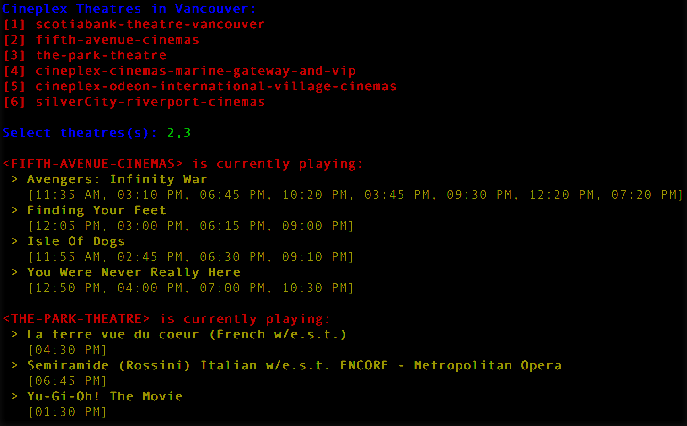

# Cineplex Scraper
Instead of having to make separate requests on the Cineplex website to see showtimes for different theatres, this web scraper allows users to see showtimes for multiple theatres all at once with just one request.
## Without the scraper 
*

*
## With the scraper 
The command line prompts the user to select a number of theatres, and then returns all the showtimes for that day.

**
